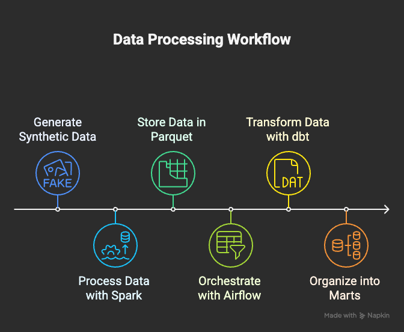
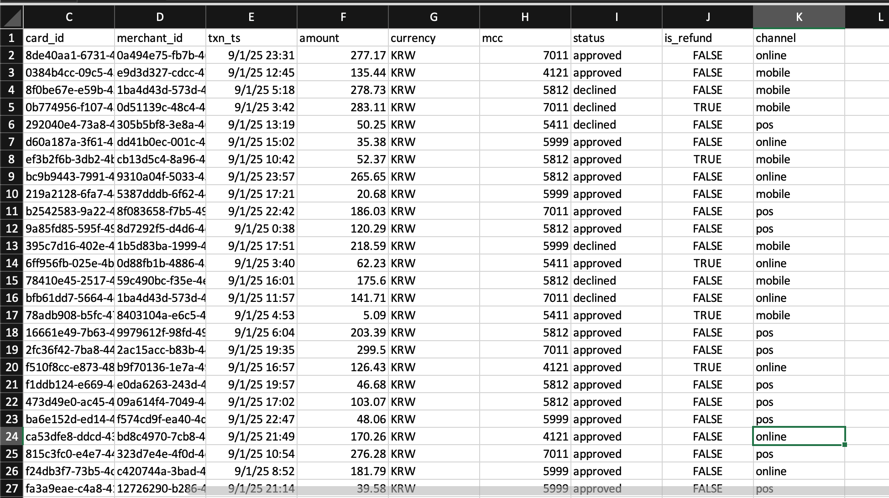
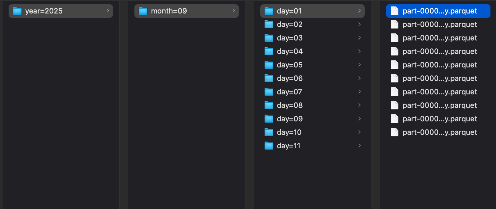
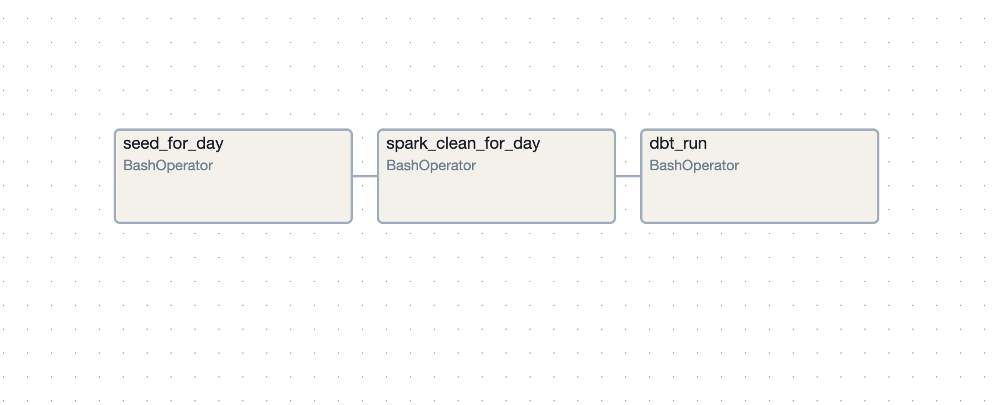
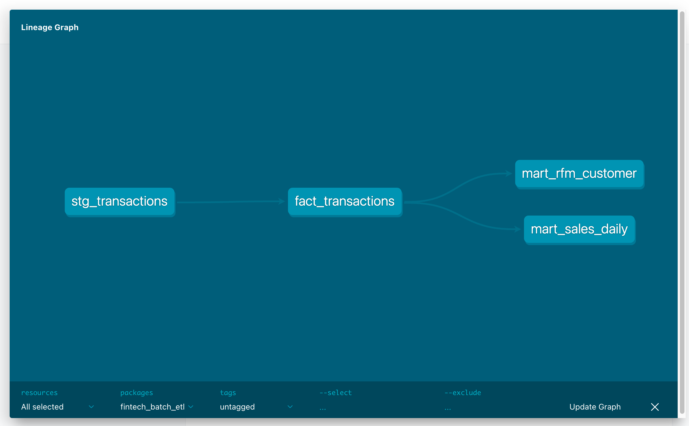
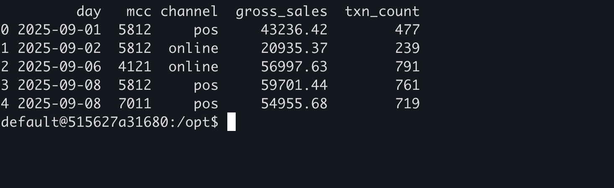

+++
title = "🚀 Building a Fintech Batch ETL Pipeline — the Modular Way"
date = 2025-09-12
tags = ["data-engineering", "pyspark", "airflow", "dbt", "aws", "etl", "pipeline", "fintech"]
categories = ["Data Engineering"]
+++

---



---


## 🎯 Batch Pipeline for Transaction Data  

Imagine: K-pop demon hunters launches a fintech startup for the fans.  
Now they have to deal with **millions of credit card transactions every day** — and they need to make sense of them.  

Those transactions power everything from:  

- **Fraud detection** → catch suspicious transactions fast.  
- **Customer insights** → build RFM segments, calculate lifetime value.  
- **Regulatory reporting** → produce accurate, auditable data for the authorities.  
- **Marketing & product analytics** → serve the right offer to the right customer at the right time.  

Without a reliable pipeline, data ends up **late, messy, duplicated** — which means **money lost, compliance risk, and very unhappy customers**.  

## 🛠️ The Modular Approach  

I wanted to build a **production-style ETL pipeline** that is reproducible, cloud-ready, and analytics-friendly.  
But I quickly realized this is a *big* project — and trying to do everything at once would be a nightmare.  

So I broke it into **modular milestones (M0 → M4):**

1. **M0 — Core:** ingest → clean → partition (local only)  
2. **M1 — Orchestration:** Airflow DAG with daily schedule + backfill  
3. **M2 — Modeling:** dbt staging/facts/marts (DuckDB local)  
4. **M3 — Cloud:** swap to AWS (S3 + Redshift)  
5. **M4 — Governance:** data quality, lineage, dashboards  

This modular setup keeps the project maintainable and shows clear progress 

## 🚦 M0 — Core Data Pipeline (Local)

Using **Faker**, I generated ~5,000 synthetic transactions per day for 11 days (Sept 1–11).  
Each row looks resembles a real credit card swipe:  


```text
transaction_id | customer_id | card_id | merchant_id | txn_ts | amount | currency | mcc | status | is_refund | channel 
````

* **mcc:** Merchant Category Code (4-digit number assigned by card networks)
* **channel:** online, POS, or mobile

I deliberately injected **duplicates** and **late arrivals** to simulate messy reality.

Then, I wrote a **PySpark job** (running in Docker) to:

* Deduplicate by `transaction_id` (latest record wins)
* Late data handled (upserted) and re-partitioned by event date
* Write **partitioned Parquet** files to:
  `silver/transactions/year=YYYY/month=MM/day=DD`

✅ **Result:**
Clean, partitioned Parquet data with <0.001% duplicate rate — ready for analytics.



## ⏰ M1 — Orchestration with Airflow

Having clean data is nice, but I don’t want to run it manually every day.
Enter **Airflow** (in Docker).

I built a simple DAG and add on dbt 

```text
seed_for_day → spark_clean_for_day → dbt_run
```


Key features:

* **Daily schedule:** runs at 06:00 AM, guaranteed to finish before 08:00
* **Backfills:** one command to reprocess past dates
* **Retries:** automatic retries for transient errors

✅ **Result:**
A pipeline that can meet **SLAs** (timely data delivery), with **automatic retries** and **backfills**.


## 📊 M2 — Modeling with dbt (DuckDB Local)

Next, I needed **analytics-friendly tables** so business teams can actually use the data.
This is where **dbt** comes in.

I built a dbt project (pointing to DuckDB locally) with:


* **Staging:** `stg_transactions` from Parquet
* **Fact:** `fact_transactions` (clean, approved-only)
* **Marts:**
  * `mart_sales_daily`: daily revenue & counts by category
  * `mart_rfm_customer`: recency, frequency, monetary scoring

I added **dbt tests** (unique keys, not null, accepted values) so data quality is enforced automatically.


Example mart query (`mart_sales_daily`):

```sql
WITH base AS (
  SELECT
    CAST(strftime(txn_ts, '%Y-%m-%d') AS DATE) AS day,
    mcc,
    channel,
    SUM(CASE WHEN is_refund THEN -amount ELSE amount END) AS gross_sales,
    COUNT(*) AS txn_count
  FROM {{ ref('fact_transactions') }}
  GROUP BY 1,2,3
)
SELECT * FROM base
```
Sample output from mart_sales_daily (grain: day × MCC × channel) — designed to keep reporting flexible.



✅ **Result:**
Business-friendly tables for **daily sales trends** and **RFM cohorts** — all reproducible in Docker with quality checks built in.

---

## 🏁 Wrapping Up (for Now)

With **M0–M2 complete**, I now have:

- ✅ Clean, deduplicated transaction data  
- ✅ Automated daily ingestion with Airflow + backfills  
- ✅ Business-ready marts (sales trends, RFM scores) with dbt tests  

This alone already feels like a mini production pipeline — reproducible, automated, and analytics-friendly.

But there’s more to come. In the **next post (M3–M4)**, I’ll take this local pipeline to the cloud, swapping DuckDB for **AWS S3 + Redshift**, adding **governance, lineage, and dashboards** — everything you’d expect in a real fintech data platform.

🎶 **Level up to the cloud**


---



---