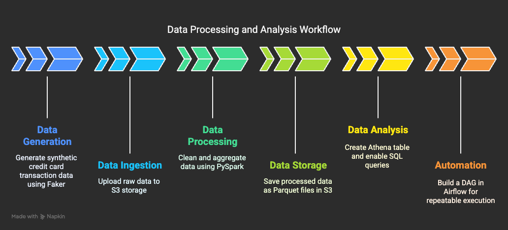

+++
title = "🚀 Building a Batch Data Pipeline with AWS, Airflow, and Spark"
date = 2025-05-01T12:00:00+09:00
draft = false
+++

# 🚀 FinTech Batch Data Pipieline 1 - Card Transaction Records

## ✨ Project Summary  

Assuming I am working for a fintech company, I built a batch pipeline that automatically aggregates → transforms → analyzes credit card data.
Since I couldn’t use real data, I used synthetic transaction data generated using Faker, but I believe it was sufficient for the purpose of designing the overall data flow and structure.


## 🎯 Goal

> **“Build an Airflow pipeline that processes realistic financial data with Spark, analyzes and stores them.”**



| **Step**           | **Description**                   | **Task**                                           |
|--------------------|-----------------------------------|----------------------------------------------------|
| **Data Generation**| Prepare raw data                  | Generate credit card transaction data using Faker  |
| **Data Ingestion** | Move to storage location          | Upload to S3 (raw)                                 |
| **Data Processing**| Clean and aggregate               | Aggregate transaction amounts by region using PySpark |
| **Data Storage**   | Store after transformation        | Save as Parquet to S3 (processed)                  |
| **Data Analysis**  | Structure for querying            | Create Athena table and enable SQL queries         |
| **Automation**     | Enable repeatable execution       | Build a DAG in Airflow                             |


## 🔧 Tech Stack

- Orchestration: Apache Airflow
- Synthetic Data Generation: Python, Faker
- Data Processing: Apache Spark (PySpark)
- Data Storage: AWS S3
- Data Querying: AWS Athena
- Infrastructure: Docker, Terraform


## 🧩 Artchitecture
```
Synthetic Data Generation → Upload to S3 → Spark Transformation → Save to S3 → Query with Athen
```
1. Generate synthetic credit card transaction data as CSV using Python's `Faker` library.

2. Upload the generated data to AWS S3.

3. Use PySpark to aggregate and transform the data by region.

4. Save the transformed data in `.parquet` format back to AWS S3.

5. Configure Athena to create a table on top of the data for SQL-based analysis.

6. Use an Airflow DAG to orchestrate the entire process automatically.


## 💢 Trouble Shooting

1. DAG not showing or stuck in queue
- Cause: The Airflow `scheduler` container was missing.
- Solution: Add a separate `scheduler` service in `docker-compose.yml`.

2. Python packages not found in Airflow 
- Cause: The container didn’t have `faker`, `boto3`, or `pyspark` installed.
- Solution: Create a custom `Dockerfile.airflow` and add `pip install -r requirements.txt`. Use this custom build in docker-compose.yml not the standard image. 

3. Airflow failure: Variable AWS_ACCESS_KEY_ID Does Not Exist 
- Cause: The variable {{ var.value.AWS_ACCESS_KEY_ID }} wasn’t set.
- Solution: Go to the Airflow UI → Admin → Variables and add it manually.

4. S3 “File Not Found” 
- Cause: Trying to save files in a non-existent folder or incorrect path.
- Solution: Ensure consistent file paths across containers and create the folder before writing.

5. DockerOperator “Cannot Connect to Docker Daemon”
- Cause: Docker socket wasn’t mounted in the Airflow container.
- Solution: In airflow-webserver service, add this to volumes.
```
- /var/run/docker.sock:/var/run/docker.sock
```
6. DockerOperator Mount Error: “Cannot unmarshal string into Go struct”
- Cause: When mounting, you need to use a proper docker.types.Mount object.
- Solution: Use the correct Mount syntax.
```
from docker.types import Mount

mounts=[Mount(source="/host/path", target="/container/path", type="bind")]
```

## ✅ Future Improvements & Next Steps

1. **Monitoring & Logging**
   - Use Airflow’s `on_failure_callback` to detect errors and send alerts via Slack/Email.
   - Extend log storage to S3 for centralized access.

2. **Performance Optimization**
   - Improve Spark job performance with partitioning and tuning parallelism.
   - Reduce Athena query costs by configuring table partitions and clustering.

3. **Data Quality Validation**
   - Integrate tools like Great Expectations for data validation.
   - Add validation tasks in the DAG to ensure data integrity.

4. **Data Visualization & Analysis**
   - Build dashboards with Looker or Power BI connected to BigQuery.
   - Explore possibilities of integrating ML models (e.g., fraud detection).

5. **CI/CD Automation**
   - Automate DAG and Terraform deployments using GitHub Actions.
   - Add unit/integration tests to improve pipeline reliability.

6. **SQL-Based Data Mart Management with dbt**
   - Manage transformation logic and documentation using dbt for better maintainability.


## 📘 Conclusion

This project allowed me to implement an end-to-end batch pipeline—from synthetic data generation to cloud upload and Spark-based ETL.  
Since the focus was on pipeline architecture rather than scale, the dataset was relatively small and the transformation logic was kept simple.  

In real-world scenarios, however, the volume of data and complexity of logic are significantly higher, which means more thorough checks are needed at each step—and troubleshooting becomes much more time-consuming.  

That’s why I believe monitoring, performance optimization, and data quality checks are essential next steps.


  
*In the data forest, a princess fixes the pipeline. She must fix it to find her way out.* 