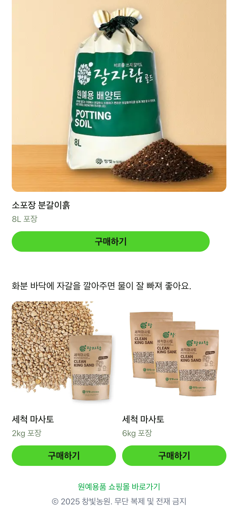

+++
title = "🌱 Making a Potting Soil Calculator – React + Vite + Netlify"
date = 2025-05-21T12:00:00+09:00
tags = ["react", "typescript", "vite", "tailwind-css", "netlify", "jest", "frontend", "web app"]
categories = ["Web App"]
draft = false
+++

  
  
  
  

## 🪴 Why I Built This
When planting in pots, figuring out how much soil you need can be surprisingly tricky.  
The volume depends on the pot’s shape, size, height, and quantity — and beginner gardeners often don’t have a clear way to calculate it.

So I decided to create a tool that allows users to quickly and intuitively calculate the soil volume needed for repotting.

## 🔧 Tech Stack
This is a frontend-only React web app.

- **React + TypeScript**: Component-based architecture with type safety
- **Vite**: Lightning-fast development and build tool
- **Tailwind CSS**: Utility-first, responsive styling
- **Netlify**: Static deployment with automatic HTTPS
- **Google Analytics (GA4)**: Traffic and behavior tracking
- **Jest + ts-jest**: Full unit test coverage (100%)

## 📦 Key Features
- Select from 4 pot shapes: rectangle, cylinder, cone, or custom surface area
- Input measurements depending on shape
- Calculate total soil volume (liters), assuming 80% fill
- Recommend optimal product combinations (20L + 8L bags)
- Suggest drainage gravel (Masato) to place at the bottom
- Mobile-friendly responsive layout
- SEO: Open Graph meta tags, favicon, sitemap.xml, robots.txt

## 💡 What I Focused On
- **Designed to encourage real purchases**  
  Not just a calculator — it integrates directly with purchase buttons and product links.

- **Robust input validation**  
  Required fields, numeric limits, and edge case handling are all in place.

- **Mobile-first user experience**  
  Big touch targets, clear labels, and clean layout for gardening beginners on smartphones.

## 🧪 Testing Matters
Even though the `calculateSoilVolume` function looks simple,  
it involves multiple formulas depending on shape, unit conversions, and rounding.  
I wrote thorough unit tests using Jest and maintain **100% test coverage**.

## 🌍 Deployment & SEO
- Deployed as a static site on Netlify
- Custom `sitemap.xml` and `robots.txt` for search engine indexing
- `og:image` and meta tags for social sharing (e.g. KakaoTalk, Facebook)
- `canonical` tag to prevent duplicate indexing

## ✨ Try It
👉 [Launch the Potting Soil Calculator](https://soilcalc.changbitfarm.com/)

## 👀 Final Thoughts
I originally started this as a simple calculator,  
but quickly realized how many details I had to consider:  
**UX, design, validation, SEO, deployment, maintainability, and even purchase flow.**

To make a truly useful tool for real users,  
I had to be deliberate at every step — from design to implementation to polish.

This may be a small web app,  
but I treated it like a product — and through that process, I experienced the full cycle of frontend product development.

## 📬 Source Code
GitHub: [https://github.com/namikimlab/potting-soil-calculator](https://github.com/namikimlab/potting-soil-calculator)