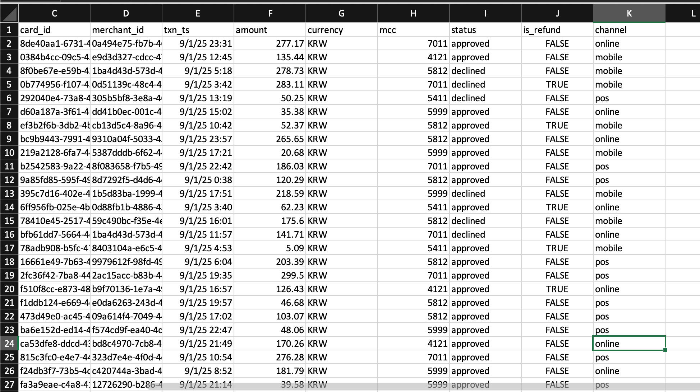

+++
title = "🚀 핀테크 배치 ETL 파이프라인 — 모듈식으로 구축하기"
date = 2025-09-12
tags = ["data-engineering", "pyspark", "airflow", "dbt", "aws", "etl", "pipeline", "fintech"]
categories = ["Data Engineering"]
+++
---
👉 코드와 이력서, 포트폴리오는 여기에 있어요
<p align="center">
  <a href="https://github.com/namikimlab" target="_blank">
    
  </a>
  <a href="https://namixkim.github.io/" target="_blank">
    
  </a>
  <a href="https://namixkim.com" target="_blank">
    
  </a>
  <a href="https://www.linkedin.com/in/namixkim/" target="_blank">
    
  </a>
</p>

---

## 🎯 거래 데이터 배치 파이프라인 

어느날 K-pop 데몬 헌터들이 핀테크 스타트업을 만들었다고 가정하자.   
이제 그들은 **매일 수백만 건의 신용카드 거래**를 처리하고 이해해야 한다.  

거래 데이터는 아래와 같이 다양하게 활용된다:  

- **사기 탐지** → 의심스러운 거래를 빠르게 탐지
- **고객 인사이트** → RFM 세그먼트 만들고 고객 생애가치(LTV) 계산  
- **규제 보고** → 당국에 정확하고 감사 가능한 데이터 제출
- **마케팅 & 제품 분석** → 적절한 고객에게 적절한 시점에 오퍼 제공 

신뢰할 만한 파이프라인이 없다면 데이터는 **늦게 도착하고, 중복되며, 엉망진창**이 된다.  
→ 이는 곧 **매출 손실, 규제 리스크, 고객 불만**으로 이어진다.  

## 🛠️ 모듈식 접근법  
나는 **프로덕션 수준 ETL 파이프라인**을 만들고 싶었는데 원하는대로 다 구현하려니 엄두가 나지 않는 거대한 프로젝트가 되어가고 있었다. 

So I broke it into **modular milestones (M0 → M4):**

1. **M0 — Core:** 로컬에서 데이터 수집 → 정제 → 파티셔닝  
2. **M1 — Orchestration:** Airflow DAG으로 매일 스케줄 + 백필(backfill)  
3. **M2 — Modeling:** dbt로 staging / fact / mart 테이블 구성 (DuckDB 로컬)  
4. **M3 — Cloud:** AWS로 전환 (S3 + Redshift)  
5. **M4 — Governance:** 데이터 품질, 리니지, 대시보드   

이렇게 쪼개면 프로젝트 유지보수도 쉬워지고, 진척 상황을 단계별로 보여줄 수 있다.  

## 🚦 M0 — 코어 데이터 파이프라인 (로컬)

**Faker**로 9월 1~11일 동안 하루 약 5,000건의 가짜 거래 데이터를 생성했다.  
각 행은 실제 신용카드 결제 데이터를 모방했다:   


```text
transaction_id | customer_id | card_id | merchant_id | txn_ts | amount | currency | mcc | status | is_refund | channel 
````

* **mcc:** 가맹점 업종 코드 (카드사에서 부여하는 4자리 숫자)
* **channel:** online, POS, mobile

실제상황을 시뮬레이션하기 위해 **중복 데이터**와 **지연 도착 데이터**도 일부 추가했다.

그리고 **PySpark 잡**(Docker에서 실행)을 작성하여:

* `transaction_id` 기준으로 중복 제거 (가장 최근 기록만 유지)
* 늦게 도착한 데이터(upsert) 반영 + 이벤트 날짜별 파티셔닝 다시 수행
* **파티셔닝된 Parquet 파일**로 저장:
  `silver/transactions/year=YYYY/month=MM/day=DD`

✅ **결과:**
중복률 <0.001% 수준으로 깨끗하고 파티셔닝된 Parquet 데이터 완성 — 바로 분석에 투입할 수 있다.


## ⏰ M1 — Airflow로 오케스트레이션

데이터는 깨끗하지만 현재로써는 매일 직접 수집을 돌려야한다. 
여기서 **Airflow** (Docker)가 등장한다.

간단한 DAG을 만들고 dbt 단계도 추가했다.

```text
seed_for_day → spark_clean_for_day → dbt_run
```


핵심 포인트:

* **매일 스케줄:** 오전 6시 실행, 8시 전 완료 보장
* **백필:** 과거 날짜 재처리 한 번에 가능
* **재시도:** 일시적 오류 시 자동 재시도

✅ **결과:**
**SLA**를 만족하는 (제때 도착하는) 파이프라인 완성.
자동 재시도와 백필도 지원한다.

## 📊 M2 — dbt로 모델링 (DuckDB 로컬)

이제 모인 데이터를 비즈니스 팀이 쓸 수 있도록 **분석 친화적 테이블**이 필요하다.
여기서 **dbt**가 등장한다.

DuckDB를 로컬로 연결해 dbt 프로젝트를 만들었다.


* **Staging:** `stg_transactions` (Parquet에서 로드)
* **Fact:** `fact_transactions` (정제 + 승인 거래만)
* **Mart:**

  * `mart_sales_daily`: 카테고리별 일별 매출, 거래 수
  * `mart_rfm_customer`: RFM 점수 계산

또한 **dbt 테스트** (unique key, not null, 값 검증)를 추가해 데이터 품질을 자동으로 보장하게 했다.


예시 mart 쿼리 (`mart_sales_daily`):

```sql
WITH base AS (
  SELECT
    CAST(strftime(txn_ts, '%Y-%m-%d') AS DATE) AS day,
    mcc,
    channel,
    SUM(CASE WHEN is_refund THEN -amount ELSE amount END) AS gross_sales,
    COUNT(*) AS txn_count
  FROM {{ ref('fact_transactions') }}
  GROUP BY 1,2,3
)
SELECT * FROM base
```
`mart_sales_daily` 샘플 출력 (grain: 일 × MCC × 채널) → 리포팅 유연성을 고려한 설계다.


✅ **결과:**
**일별 매출 트렌드**와 **RFM 코호트**를 확인할 수 있는 비즈니스 친화적 테이블 완성.
모두 Docker에서 재현 가능하며, 데이터 품질 테스트까지 자동화된다.

---

## 🏁 여기까지의 정리

**M0–M2** 단계가 끝나면서 이제 나는:

* ✅ 깨끗하고 중복 없는 거래 데이터 확보
* ✅ Airflow로 매일 자동 수집 + 백필
* ✅ dbt 테스트가 적용된 비즈니스용 mart 생성

이 단계만으로도 미니 프로덕션 파이프라인 느낌이 난다.
재현 가능하고, 자동화되어 있고, 분석 친화적이다.

하지만 아직 끝이 아니다.
**다음 글 (M3–M4)**에서는 DuckDB 대신 **AWS S3 + Redshift**를 사용해 클라우드로 옮기고,
**거버넌스, 리지니, 대시보드**까지 추가해 더 리얼한 핀테크 데이터 플랫폼으로 발전시킬 예정이다.

🎶 **클라우드로 뿅**


---
👉 코드와 이력서, 포트폴리오는 여기에 있어요
<p align="center">
  <a href="https://github.com/namikimlab" target="_blank">
    
  </a>
  <a href="https://namixkim.github.io/" target="_blank">
    
  </a>
  <a href="https://namixkim.com" target="_blank">
    
  </a>
  <a href="https://www.linkedin.com/in/namixkim/" target="_blank">
    
  </a>
</p>

---
