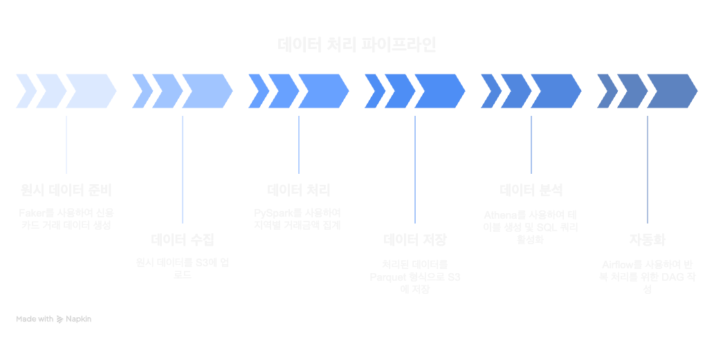

+++
title = "🚀 핀테크 배치 데이터 파이프라인 구축기: AWS, Airflow, Spark"
date = 2025-05-01T12:00:00+09:00
tags = ["data engineering", "python", "pipeline", "fintech", "airflow", "spark"]
categories = ["Data Engineering"]
draft = false
+++

## ✨ 프로젝트 개요  

핀테크 회사를 가정해, 카드사 데이터를 자동으로 집계 → 정제 → 분석하는 배치 파이프라인을 구축해보았다.
실제 데이터를 사용할 수는 없었기에 Faker를 활용해 가상의 거래 데이터를 생성했지만,
전체적인 데이터 흐름과 구조를 설계하는 데에는 충분하다고 생각된다. 


## 🎯 목표

> **“Airflow를 활용해 현실적인 금융 데이터를 Spark로 처리하고, 저장 및 분석까지 가능한 자동화된 파이프라인을 만들어보자.”**



| 단계 | 설명 | 작업 |
|------|------|----------------|
| **데이터 생성** | 원시 데이터 준비 | Faker로 신용카드 거래 데이터 생성 |
| **데이터 수집** | 저장 위치로 이동 | S3에 업로드 (raw) |
| **데이터 처리** | 정제, 집계 | PySpark로 지역별 거래금액 집계 |
| **데이터 저장** | 가공 후 저장 | S3에 Parquet 저장 (processed) |
| **데이터 분석** | 쿼리용 구조 구성 | Athena로 테이블 생성 및 SQL 가능 |
| **자동화** | 반복 처리 가능하게 설정 | Airflow로 DAG 작성 |


## 🔧 기술 스택  

- 오케스트레이션: Apache Airflow
- 가상 데이터 생성: Python, Faker
- 데이터 처리: Apache Spark (PySpark)
- 데이터 저장: AWS S3
- 데이터 쿼리: AWS Athena
- 인프라: Docker, Terraform


## 🧩 아키텍처 구성
```
가상 데이터 생성 → S3 업로드 → Spark 변환 → S3 저장 → Athena로 쿼리
```
1. Python의 Faker 라이브러리로 가상의 신용카드 거래 데이터 CSV 생성 

2. 생성된 데이터를 S3 업로드

3. PySpark로 지역별 집계, 변환 

3. 변환된 데이터를 .parquet 포맷으로 AWS S3에 저장

4. Athena에서 해당 데이터를 테이블로 구성하여 SQL 분석 가능

5. Airflow DAG로 전체 과정을 자동으로 오케스트레이션


##  💢 트러블슈팅과 삽질의 기억
1. 에어플로우 DAG가 안나옴, 큐에서 멈춤
- 원인: 에어플로우 scheduler 컨테이너가 없음
- 해결: 별도의 scheduler service 를 docker-compose.yml 에 추가 

2. 에어플로우에서 파이썬 패키지가 안나옴 
- 원인: 컨데이너에 faker, boto3, pyspark 설치되지 않음 
- 해결: 커스텀 Dockerfile.airflow 만들고 안에 pip install -r requirements.txt 추가. docker-compose.yml 에서 image: 말고 build:로 이 커스텀 빌드 사용.

3. 에어플로우 실패 Variable AWS_ACCESS_KEY_ID Does Not Exist 
- 원인: {{ var.value.AWS_ACCESS_KEY_ID }} 세팅이 안되었음
- 해결: 에어플로우UI에서 Admin -> Variables 추가 

4. S3 “File Not Found” 
- 원인: 존재하지 않는 폴더에 저장 시도, 파일 경로 불일치 
- 해결: 컨테이너들 사이에 파일 경로 통일, 폴더 생성 후 저장 

5. DockerOperator “Cannot Connect to Docker Daemon”
- 원인: 도커 소켓이 에어플로우 컨테이너에 마운트 안됨
- 해결: airflow-webserver service volumns 에 아래 추가
```
- /var/run/docker.sock:/var/run/docker.sock
```
6. DockerOperator Mount Error: “Cannot unmarshal string into Go struct”
- 원인: mount 할때 docker.types.Mount 오브젝트를 사용해야함
- 해결: Mount 문법에 맞게 사용
```
from docker.types import Mount

mounts=[Mount(source="/host/path", target="/container/path", type="bind")]
```

## ✅ 개선방향: 더 해보고 싶은것! 

1. 모니터링 & 로깅
- Airflow의 on_failure_callback 활용해 에러 감지 및 Slack/Email 알림 도입
- 로그 저장 위치를 S3로 확장 가능

2. 성능 최적화
- Spark 처리 성능 개선: 파티셔닝, 병렬성 조정
- 테이블 파티션/클러스터 설정으로 쿼리 비용 감소

3. 데이터 품질 검증
- Great Expectations 같은 데이터 검증 도구 도입
- DAG 안에서 데이터 유효성 체크 Task 추가

4. 데이터 시각화 & 분석
- BigQuery와 연결된 대시보드를 Looker, Power BI 등으로 구성
- 향후 ML 모델 (예: 이상 거래 탐지) 연동 가능성 탐색

5. CI/CD 자동화
- GitHub Actions로 DAG, Terraform 변경 자동 배포
- 유닛/통합 테스트 추가해 안정성 확보

6. dbt 연동을 통한 SQL 기반 마트 관리

## 📘 결론
데이터 생성부터 클라우드 업로드, Spark ETL 까지 배치 파이프라인 전체를 구현해볼 수 있었다. 이번 프로젝트는 파이프라인 구현에 중점을 두었기 때문에 데이터도 크지 않았고 변환 로직도 복잡하게 적용하지 않았다. 실제 업무에서는 데이터양과 로직이 복잡한 만큼 각 단계에서 점검할 부분이 훨씬 많고 에러 해결에 시간도 훨씬 많이 걸릴 것이라고 생각된다. 

따라서 모니터링, 성능최적화, 데이터 품질체크가 필수적인 다음 단계로 생각된다. 


*데이터 숲속에서 파이프라인을 고치는 공주. 고쳐야 숲을 나갈 수 있다.* 