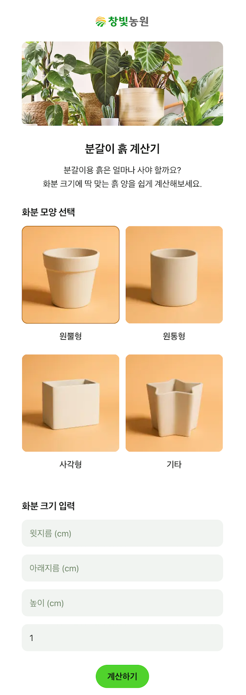

+++
title = "🌱 분갈이 흙 계산기를 만들었어요 – React + Vite + Netlify"
date = 2025-05-21T12:00:00+09:00
tags = ["react", "typescript", "vite", "tailwind-css", "netlify", "jest", "frontend", "web app"]
categories = ["Web App"]
draft = false
+++

## ✨ 결과물
[분갈이 흙 계산기 바로가기](https://soilcalc.changbitfarm.com/)

## 📬 소스코드
GitHub: [https://github.com/namikimlab/potting-soil-calculator](https://github.com/namikimlab/potting-soil-calculator)

## 🪴 왜 만들었을까?
화분에 식물을 심을 때, 흙이 얼마나 필요한지 계산하는 게 은근히 번거롭습니다.
화분의 모양, 크기, 높이, 개수에 따라 달라지기 때문인데요.
초보 가드너나 원예 입문자들이 직관적으로 흙 용량을 계산할 수 있는 도구가 있었으면 좋겠다는 생각에서 이 프로젝트를 시작했습니다.

## 🔧 이런 기술을 썼어요
이 계산기는 프론트엔드만으로 구성된 React 웹앱입니다.

- React + TypeScript: 안정적인 컴포넌트 기반 구조
- Vite: 빠른 개발 환경 구성 및 빌드
- Tailwind CSS: 가볍고 직관적인 스타일링
- Netlify: 정적 사이트 배포 및 HTTPS 자동 적용
- Google Analytics (GA4): 방문자 추적
- Jest + ts-jest: 100% 유닛 테스트 커버리지

## 📦 주요 기능
- 화분 모양 선택 (사각형, 원통형, 원뿔형, 기타)
- 각 모양에 맞는 사이즈 입력
- 계산된 결과에 따라 흙 용량(L) 출력
- 20L + 8L 분갈이흙 제품 조합 추천
- 마사토(배수용 자갈)도 함께 제안
- 반응형 웹 지원 (모바일 최적화)
- SEO를 위한 Open Graph 메타태그, favicon, sitemap.xml, robots.txt 설정

## 💡 이런 점을 신경 썼습니다
- **실제 구매로 이어지도록 설계**  
단순한 계산기 수준이 아니라, 구매 버튼까지 연결되도록 구성했습니다.

- **사용자 입력에 대한 예외 처리**  
필수값 검증 등 기본적인 방어 로직 포함

- **모바일 유저도 고려한 UI**  
터치 가능한 큰 버튼, 간결한 입력창, 텍스트 강조 등으로 접근성을 높였습니다.

## 🧪 테스트
calculateSoilVolume 로직은 단순해 보여도,
형태별 공식이 다르고 정수 반올림, 단위 변환, 곱셈 오차가 발생할 수 있어
Jest 기반으로 단위 테스트를 작성했고, 현재 100% 커버리지를 유지하고 있습니다.

## 🌍 배포 및 SEO
- Netlify로 정적 배포
- sitemap.xml, robots.txt 직접 작성
- og:image 설정 (카카오톡, 페이스북 공유 대응)
- Canonical 태그로 중복 URL 방지

## 🎨 AI를 활용한 디자인

- 간단한 손그림 스케치에서 시작해 자연스러운 컬러 팔레트를 선정했습니다.
- **Google Stitch**를 활용해 UI 레이아웃, 타겟 사용자, 주요 기능을 기반으로 디자인 컨셉을 생성했습니다.
- 초기 스케치를 바탕으로 **ChatGPT의 이미지 생성 기능**을 사용해 화분 모양 아이콘을 만들었습니다.
- 여러 AI 도구를 결합해 디자이너 없이도 빠르게 일관된 프로덕션 수준의 UI를 구축했습니다

## 👀 마무리하며
처음엔 단순한 흙 계산기 하나 만들어보자는 마음으로 시작했지만,
막상 만들다 보니 UX, 디자인, 입력 검증, SEO, 배포, 유지보수성, 실제 구매 흐름까지 고려할 것들이 꽤 많았습니다.

사용자에게 가치를 주는 작은 도구를 만들기 위해
기획부터 구현, 배포까지 하나하나 신경 써야 했고,
그 과정에서 프론트엔드 제품 개발의 전체 흐름을 다시 한번 체감할 수 있었습니다.

작은 웹앱이지만, 실사용자를 염두에 두고 고민하며 만든 만큼
포트폴리오 이상의 의미가 있었던 프로젝트였습니다.

